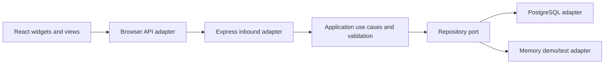

# Architecture and learning guide

Hexagonal architecture places rules at the center. Ports define how the application talks to outside systems; adapters implement those contracts.

- `server/domain/hub.js`: rules, validation and repository contract (`list/get/save/remove`). No framework or database dependencies.
- `server/adapters`: interchangeable storage implementations. PostgreSQL values use parameterized SQL.
- `server/http.js`: translate HTTP into application calls and errors into responses.
- `server/main.js`: composition root choosing concrete adapters.
- `src/adapters/api.js`: browser data adapter.
- `src/components`: feature views/widgets with injected data/actions. Notes supports compact and full rendering; Agenda can render independently of Calendar.
- `src/main.jsx`: browser entry point, mounting the app with its API adapter.
- `src/App.jsx`: shell navigation, preferences, data loading and composition.
- `src/components/EventEditor.jsx` and `Settings.jsx`: focused editor and settings views.
- `src/components/Agenda.jsx`: independent upcoming-event widget and full agenda.
- `src/styles.css`: theme tokens, layout and touch sizing.

## React for a JavaScript developer

A component is a JavaScript function returning JSX, an HTML-like syntax. Props are its inputs. `useState` stores changing values and schedules redraws. `useEffect` connects to external systems (timers, fetching); its cleanup disconnects them. Controlled inputs take their value from state and update it via handlers. Components receive callbacks to request actions without knowing how storage works.

Follow a note save: `Notes` calls its injected `onSave`; the shell calls the browser adapter; Express calls the domain; the domain validates and calls the repository; the shell updates state from the saved result. The same `Notes` component works as a dashboard widget or full notebook. Standalone means independent composition, not separate deployed microservices.

## Extend the system

1. Define a feature's rules and data contract in the domain. Split use cases into separate modules as complexity grows.
2. Implement required repository ports/adapters; update the SQL kind constraint for new record kinds. Use numbered migrations for future schema changes.
3. Create a component receiving only its own data/actions, with a compact rendering when useful.
4. Add its navigation/widget in the shell and preference defaults. Adjust CSS tokens for appearance.
5. Test meaningful domain and HTTP behavior.

ISO UTC instants are stored and converted to the screen timezone. Display preferences use localStorage; shared records use PostgreSQL. The starter uses indexed metadata and JSONB payloads; add structured tables when features need relational queries. External calendar integrations and notification providers should implement new ports instead of coupling widgets to providers. There is currently no offline write queue, all-day model, authentication or edit-conflict resolution.

## Family calendar

`shared/calendar.js` provides pure recurrence expansion, AM/PM conversion, and
member-color styling. Calendar and Agenda expand only their display range, keeping
one source event per series in storage. `completedDates` tracks completion per
local occurrence date; the shell maps edits back to the original series. Defaults
make existing events non-repeating and unassigned.

`FamilyMembers` receives shared records and injected save/delete actions. Domain
validation requires a member name and six-digit hex color. The memory adapter and
PostgreSQL partial unique index enforce color uniqueness during concurrent saves.
Assigned members cannot be deleted until their events are reassigned. Preferences
remain per screen; members and events are shared through the selected storage.
